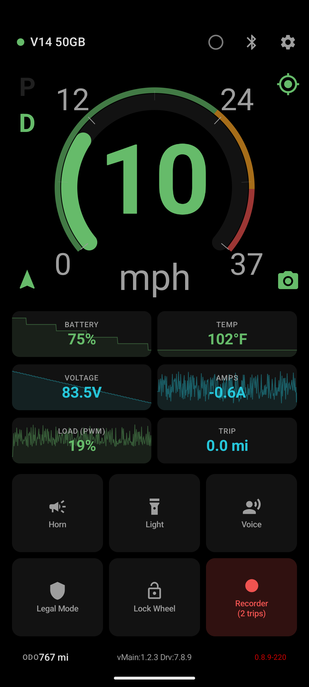

# EUC Planet

An open-source Android companion app for the **InMotion V14** electric unicycle.

Built because every other EUC app either asks for a monthly subscription, ships a crummy UI, loses connection, or locks useful features behind paywalls. This one is free, does the things I actually want while riding, and doesn't phone home.

> **Scope note:** right now this supports the **InMotion V14 only** (V2 BLE protocol, `Adventure-*` devices). The architecture is protocol-agnostic, so other InMotion wheels, and eventually other brands, can be added later.

---

## Features

### Dashboard
- Large arc speed gauge with dynamic red/orange/yellow/green zones based on your tiltback setting.
- Live battery %, voltage, amps, temperature, PWM load, trip distance.
- Tap any tile to jump to a historical graph (last 5 minutes).
- Imperial or metric units (km/h ↔ mph, °C ↔ °F, km ↔ mi).
- One-screen layout, no scrolling, dark theme.

### Wheel Control
- Horn, light toggle, wheel lock, legal-mode speed cap, voice announcements, all one tap away.
- **Legal Mode**: configurable speed cap that reprograms the wheel's tiltback + alarm speeds temporarily, then restores your normals when you turn it off.
- Keeps BLE alive via a foreground service with automatic reconnect.

### Custom Alarms
- Define your own threshold-based alarms on speed, battery, temperature, PWM, voltage, current.
- Each alarm can independently fire a beep (custom tone + pitch), a TTS voice message (template-based, e.g. `"Battery at {value}%"`), and/or vibration.
- Cooldown and repeat-while-active settings so alarms don't spam.
- Inline preview buttons for beep / voice / vibration while editing.

### Voice Announcements
- Periodic reports at a configurable interval.
- On-demand reports via the voice button or a Flic trigger.
- Separate toggles for periodic vs. trigger reports (speed, battery, temp, PWM, distance, recording).
- Drag-to-reorder report items.
- Configurable TTS speech rate and locale (multilingual TTS supported).
- Special event announcements: lock/unlock, lights on/off, GPS fix, connection, legal mode, recording start/stop.

### Trip Recording
- GPS + telemetry logged to **DarknessBot-compatible CSV**. Drop the files into <https://github.com/eried/darknessbot> or DarknessBot's own viewer and your rides just work.
- Auto-record on wheel connect (opt-in).
- Live map preview of the recorded track.
- Trip list with quick ZIP export and share.

### Automations
- **Auto Lights**: turn lights on before sunset and off after sunrise, based on live GPS location. Handles midnight sun and polar night.
- **Auto Volume**: phone media volume scales with wheel speed along a configurable curve.

### Integrations
- **Flic 2 buttons**: pair up to two buttons, map click / double-click / hold on each to any wheel action (horn, light, lock, legal mode, voice, record toggle, media play/pause/next/previous).
- **Volume keys**: use the phone's physical volume up/down (click + hold) as shortcuts while the app is on screen.

### Settings
- Tiltback + alarm speeds written directly to the wheel.
- Legal-mode speeds stored separately and applied on toggle.
- Auto-connect to last-paired wheel on app start.
- Imperial/metric switch for the whole UI.

---

## Requirements

- Android 10 (API 29) or newer.
- InMotion V14 (firmware running the V2 BLE protocol, device advertises as `Adventure-…`).
- Bluetooth + location permissions (location is required by Android for BLE scanning).

## Install

Grab the latest APK from the [releases](../../releases) page and sideload it, or build from source:

```bash
./gradlew assembleDebug
adb install app/build/outputs/apk/debug/app-debug.apk
```

## Screenshots

_Coming soon. I'll drop photos and screen recordings here._

<!--



-->

---

## Why does this exist?

I got tired of:
- paying a monthly sub to talk to a wheel I already own,
- apps that look like they were built in 2014,
- apps that silently lose BLE and you only notice when the wheel hits its internal tiltback at an unexpected speed,
- apps that treat your GPS trace as the vendor's property.

The goal here is a single-screen, keep-it-working dashboard with the integrations (Flic, voice, alarms, GPS) that I actually use while riding, exported to formats (DarknessBot CSV) that are not locked to this app.

## Contributing

The BLE protocol layer is separate from the UI, so adding a new wheel is mostly: write a new protocol encoder/decoder and a new parser, then wire it into `WheelRepository`. PRs welcome. Issues and requests are also welcome, just open one on GitHub.

## License

TBD (likely MIT). The Flic 2 SDK and any third-party dependencies retain their own licenses.
