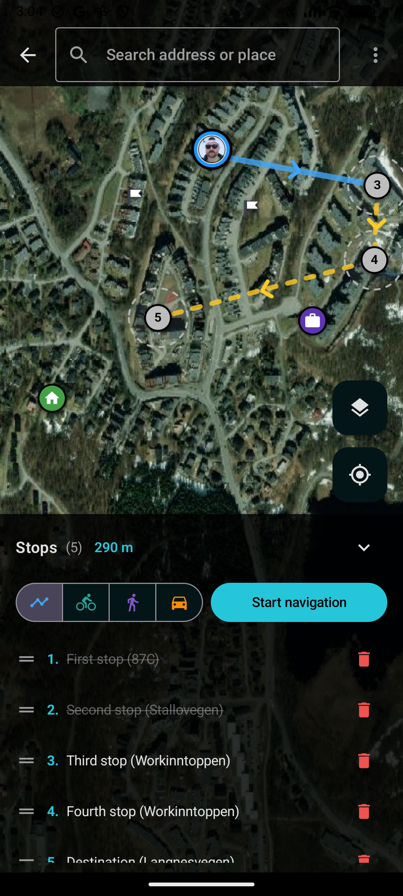
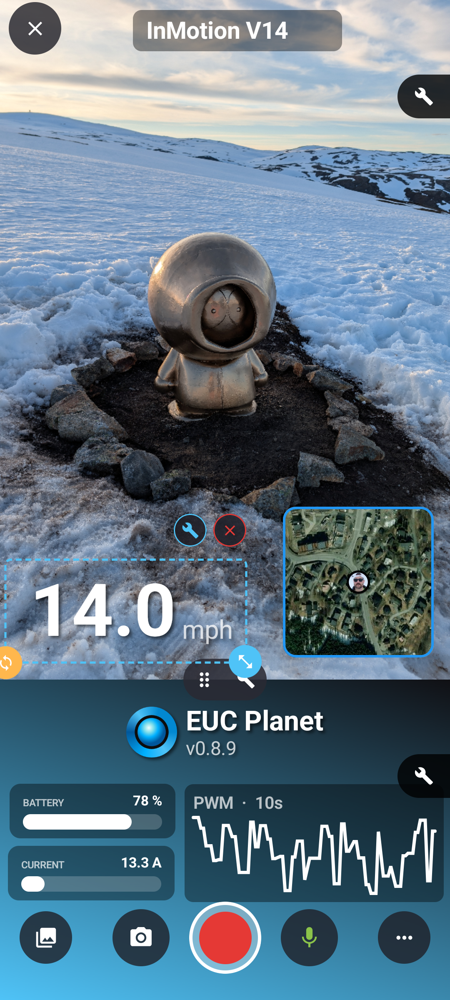
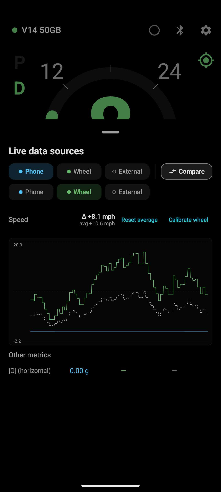
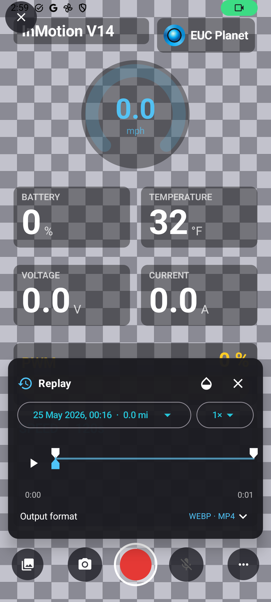
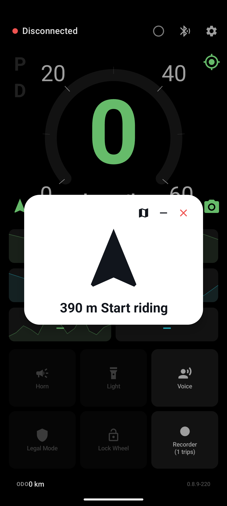
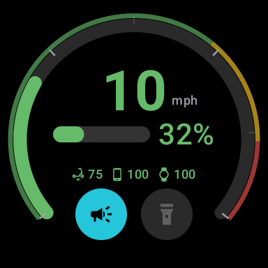
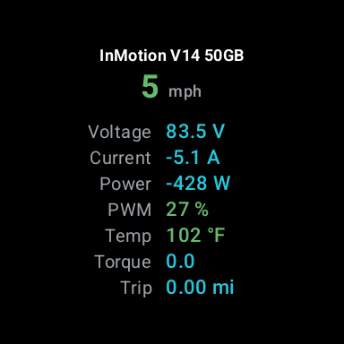
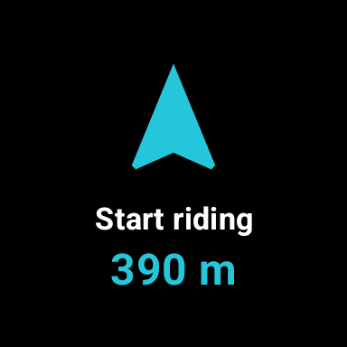
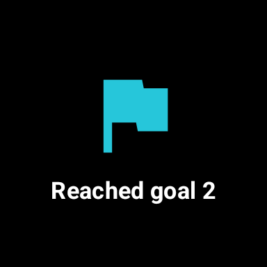

# EUC Planet

[](https://github.com/eried/eucplanet/releases)
[](LICENSE)
[](https://play.google.com/store/apps/details?id=com.eried.eucplanet)
[](https://t.me/EUCPlanetApp)
[](https://www.paypal.com/donate/?hosted_button_id=AEB2RPZHNRTKG)
[](https://github.com/eried/eucplanet/releases)

Open-source Android app for electric unicycles: live telemetry, turn-by-turn
navigation, an on-screen overlay for video recording, and many other integrations.
I don't want to pay to just enjoy a wheel I already own. No ads, no in-app
tracking, no subscriptions, no upselling, no features behind a paywall, no
telemetry phoned home.

## What wheels work?

I only own and ride a V14. Everything else gets done through collaboration with
riders who have the wheel.

| Status | Wheels |
|---|---|
| **Verified** | InMotion V14 (50GB / 50S) |
| **Verified** | InMotion P6 |
| **In test** | Begode/Gotway Master, Master Pro, T3, T4, RS, RS-HT, EX, EX.N, EX2, MSP, MSX, Hero, XWay, Mten4, Mten5, MCM5 |
| **In test** | Veteran Sherman, Sherman S, Sherman Max, Patton, Lynx, Abrams |
| **In test** | KingSong S22, S20, S19, S18, S16, KS-14/16/18, F18P, F22P |
| **Waiting to be tested** | InMotion V12 HS / HT / Pro |
| **Waiting to be tested** | InMotion V1 family: V5, V8, V8F, V8S, V10, V10F, V10S, V10T, V10FT, L6, Lively, Glide 3 |
| **Waiting to be tested** | Ninebot Z6, Z10, plus legacy One E / E+ / S2 / Mini (read-only) |
| **Experimental** | InMotion V9, V11, V13 |

More on the tiers and the protocol docs: [WHEELS.md](WHEELS.md).

Help with your wheel, check the [BLE capture guide](docs/BLE_CAPTURE_GUIDE.md).
Already connects but a reading looks wrong? See the [in-app diagnostics guide](docs/DIAGNOSTICS_GUIDE.md).

---

## Gallery

   

   

<table>
<tr>
<td align="center"><br><sub>Speed dial</sub></td>
<td align="center"><br><sub>Telemetry</sub></td>
<td align="center"><br><sub>Navigation</sub></td>
<td align="center"><br><sub>Arrival flag</sub></td>
</tr>
</table>

---

## Features

**Dashboard.** Live speed, battery, voltage, amps, temperature, PWM load and
distance. Rearrange the tiles, build composite tiles and action groups, add a live
runtime clock. Tap any tile for its history graph. Metric or imperial.

**Turn-by-turn navigator.** Multi-stop routes on a map (walk, bike, car,
straight-line), voice cues, off-route reroute, sticky GPS, and a Treasure Hunt
proximity mode for unmarked spots. The next-turn arrow can mirror to your watch.

**Overlay Studio.** Record video and stills with a customisable telemetry overlay:
dials, gauges, rolling graphs, `{speed}`-style text, mini-map, layered cameras. Save
layouts as JSON. Export a finished MP4, or a transparent overlay to composite over
footage from another camera.

**Wheel control.** Horn, lights, lock, voice announcements, all one tap away. Legal
Mode temporarily reprograms the wheel's tiltback and alarm speeds to a cap you set,
then restores your normal settings when you switch it off.

**Custom alarms.** Your own thresholds on speed, battery, temperature, PWM, voltage
or current. Each can beep (custom tone and pitch), speak (`"Battery at {value}%"`),
and/or vibrate, with cooldowns so they don't nag.

**Voice announcements.** Periodic reports at your interval, configurable rate and
locale, plus event callouts: lock/unlock, lights, GPS fix, connection, legal mode,
recording.

**Trip recording.** GPS and telemetry to DarknessBot-compatible CSV, auto-record,
live track preview, and a trip list with quick export and share. View them later in
the [web Trip Viewer](https://github.com/eried/eucviewer).

**Automations.** Auto Lights on before sunset, off after sunrise, from live GPS.
Handles midnight sun and polar night (I live in the arctic circle 🧐). Auto Volume
scales phone volume with speed.

**Integrations.** Flic 2 buttons (up to two), physical volume-key shortcuts,
external BLE GPS (RaceBox or compatible, for centimetre-class speed and altitude
without draining the phone radio; auto-falls back to phone GPS), a Wear OS
companion (speed dial, three batteries, horn/light remotes, navigation mirror;
tested on Galaxy Watch Ultra, works on any Wear OS 5+ watch), and a Garmin
Connect IQ companion (same dial on Garmin watches and Edge bike computers,
settings shared with Wear OS; on the
[Connect IQ Store](https://apps.garmin.com/apps/630e5d32-637d-4612-84e3-35e6d0bbee10)).

**14 languages.** Full UI localisation, at parity across all of them.
### Integrations
- **Flic 2 buttons**: pair up to two buttons.
- **Volume keys**: use the phone's physical volume up/down for extra shortcuts.
- **External GPS**: pair a RaceBox (or any compatible BLE GPS) for centimetre-class speed and altitude without burning the phone radio. Falls back to phone GPS automatically.
- **Garmin Varia rear-view radar**: pair a Varia (RTL515 / RTL516 / RVR315 / RCT715 / eRTL615 / RearVue 820 / RVR53320). A translucent lane bar hovers on the screen edge with one coloured dot per detected vehicle, red glow on fast closers. Two new alarm metrics (*Car distance*, *Car approach*) plug into the existing alarm engine so you can wire vibrate / beep / voice to "car within 30 m" or "car closing at 60+ km/h". Light control is not yet supported (Garmin keeps that UUID under NDA; every public client drives Varia lights over ANT+ instead).
- **Wear OS companion**: full-bleed speed dial, three batteries (wheel/phone/watch), accent and unit settings synced from the phone, horn + light remote controls, navigation cue mirror. Tested on Galaxy Watch Ultra; works on any Wear OS 5+ watch.

---

## Where do I get it?

[Google Play](https://play.google.com/store/apps/details?id=com.eried.eucplanet) has
a small symbolic price, treat it as a tip if you'd like to support the project and
get automatic updates. Or grab the latest APK from [releases](../../releases) for
free and sideload it. Same app either way.

Build from source:

```bash
./gradlew assembleDebug
adb install app/build/outputs/apk/debug/phone-debug.apk
```

Needs Android 10 (API 29) or newer, a supported wheel, and Bluetooth + location
permissions (Android requires location for BLE scanning). Camera and mic are
optional and only asked for the first time you open Overlay Studio.

---

## Why does this exist?

I got tired of:

- apps that look like they were built in 2014,
- waiting forever for fixes or improvements,
- inflexible developers over just bad designs,
- apps that call home and spy on you.

## Contributing

The BLE layer is separate from the UI. Each brand family has its own `WheelAdapter`
in [`app/src/main/java/com/eried/eucplanet/ble/`](app/src/main/java/com/eried/eucplanet/ble/),
and `CompositeWheelAdapter` routes by the advertised BLE name at connect time. Specs
live in [`docs/protocols/`](docs/protocols/).

To add a wheel: implement `WheelAdapter` (parser plus commands), register it in
`CompositeWheelAdapter`, add the BLE-name pattern to `BleScanner`. The
[BLE capture guide](docs/BLE_CAPTURE_GUIDE.md) is the fast path; one labelled ride is
usually enough. If a supported wheel misbehaves instead, the
[in-app diagnostics guide](docs/DIAGNOSTICS_GUIDE.md) walks owners through sending a
Service Mode recording.

PRs welcome. Bugs go to [Issues](../../issues). Live discussion is on
[Telegram](https://t.me/EUCPlanetApp), and more serious ideas and votes go to
[ideas.ried.no/euc-planet](https://ideas.ried.no/euc-planet).

## Support

EUC Planet is free and stays free. If it saved you a subscription, or for any other
reason you want to chip in: [donate via PayPal](https://www.paypal.com/donate/?hosted_button_id=AEB2RPZHNRTKG).
Entirely optional, very appreciated.

## License

Released under the [MIT License](LICENSE), use it, fork it, build on it, just keep
the copyright notice. The Flic 2 SDK and other third-party dependencies keep their
own licenses.
