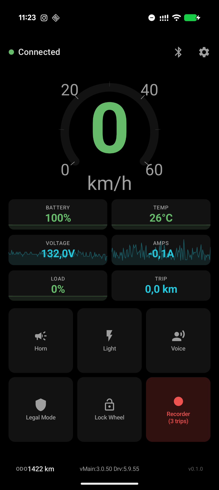
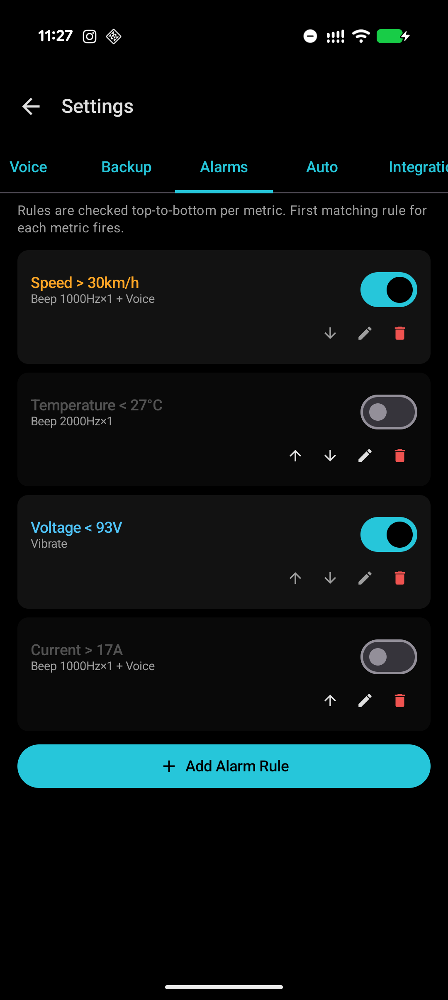
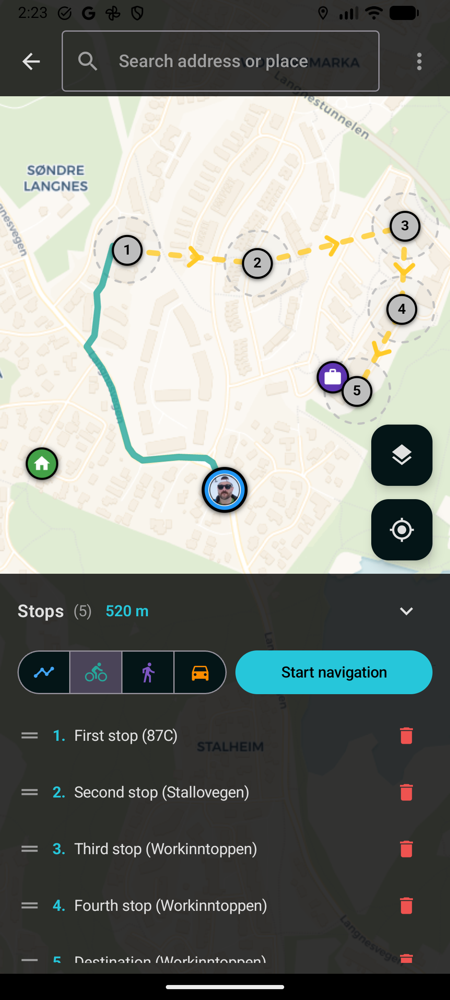
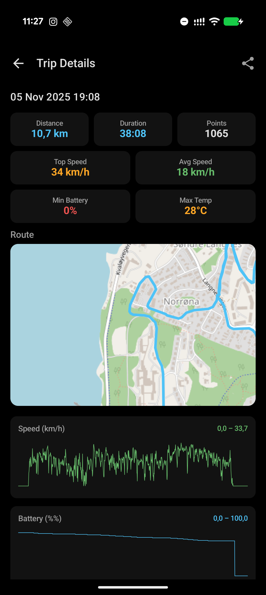
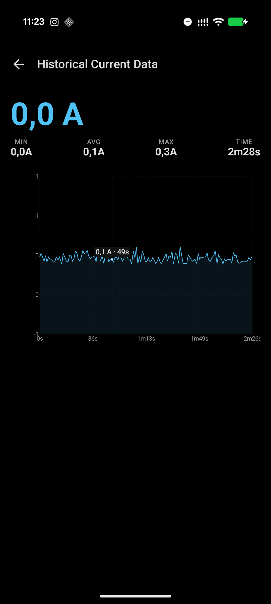
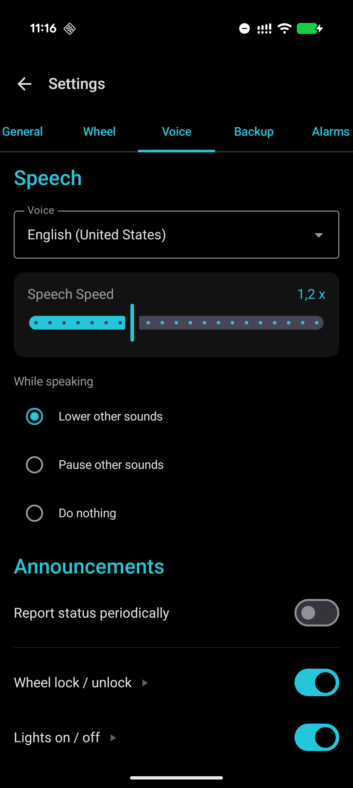
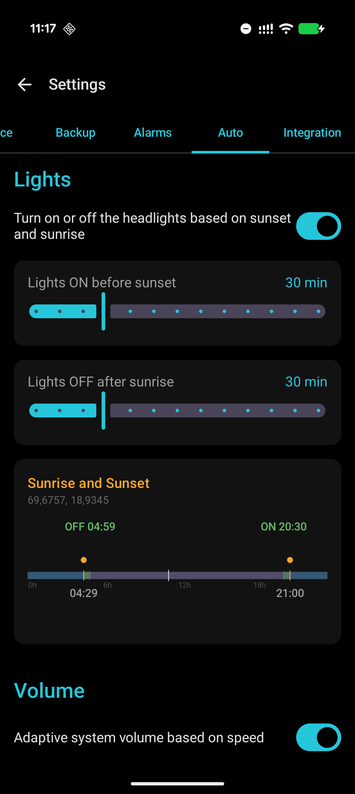
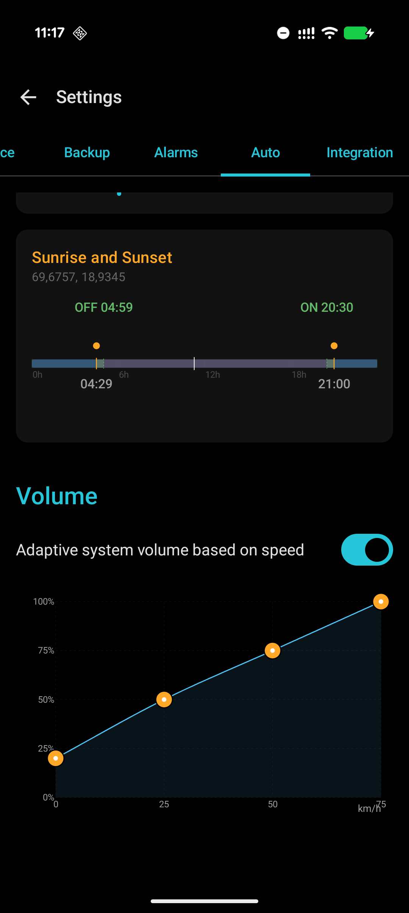
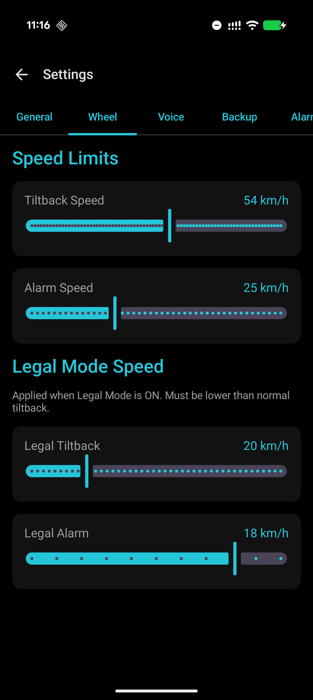
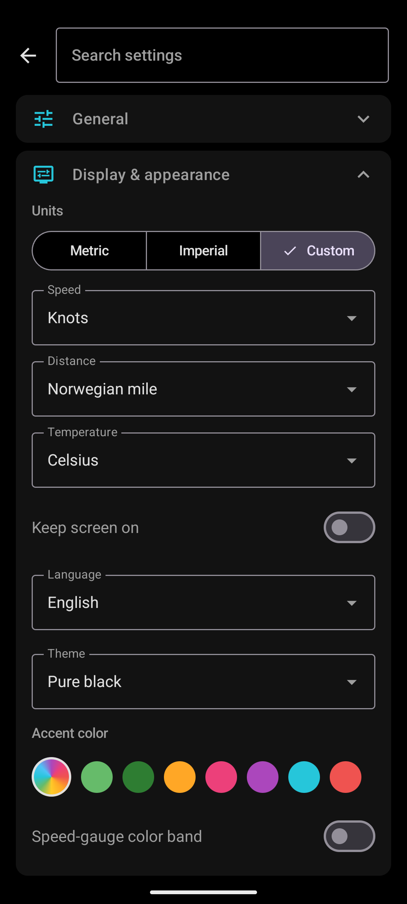

# EUC Planet

An open-source Android companion app for the **InMotion V14** electric unicycle.

Built because every other EUC app either asks for a monthly subscription, ships a crummy UI, loses connection, or locks useful features behind paywalls. This one is free, does the things I actually want while riding, and doesn't phone home.

> **Scope note:** right now this supports the **InMotion V14 only** (V2 BLE protocol, `Adventure-*` devices). The architecture is protocol-agnostic, so other InMotion wheels, and eventually other brands, can be added later.

---

## Gallery

   

     

---

## Features

### Dashboard
- Live speed, battery %, voltage, amps, temperature, PWM load, trip distance.
- Tap any tile to jump to a historical graph.
- Imperial or metric units.

### Wheel Control
- Horn, light toggle, wheel lock, legal-mode speed cap, voice announcements, all one tap away.
- **Legal Mode**: configurable speed cap that reprograms the wheel's tiltback + alarm speeds temporarily, then restores your normals when you turn it off.

### Custom Alarms
- Define your own threshold-based alarms on speed, battery, temperature, PWM, voltage, current.
- Each alarm can independently fire a beep (custom tone + pitch), a TTS voice message (template-based, e.g. `"Battery at {value}%"`), and/or vibration.
- Cooldown and repeat-while-active settings so alarms don't spam.

### Voice Announcements
- Periodic reports at a configurable interval.
- Configurable TTS speech rate and locale (multilingual TTS supported).
- Special event announcements: lock/unlock, lights on/off, GPS fix, connection, legal mode, recording start/stop.

### Trip Recording
- GPS + telemetry logged to **DarknessBot-compatible CSV**.
- Auto-record.
- Live map preview of the recorded track.
- Trip list with quick export and share.

### Automations
- **Auto Lights**: turn lights on before sunset and off after sunrise, based on live GPS location. Handles midnight sun and polar night (I live in the arctic circle 🧐).
- **Auto Volume**: phone volume changes based on speed.

### Integrations
- **Flic 2 buttons**: pair up to two buttons.
- **Volume keys**: use the phone's physical volume up/down for extra shortcuts.
- 
---

## Requirements

- Android 10 (API 29) or newer.
- InMotion V14 (firmware running the V2 BLE protocol, device advertises as `Adventure-…`).
- Bluetooth + location permissions (location is required by Android for BLE scanning).

## Install

Grab the latest APK from the [releases](../../releases) page and sideload it, or build from source:

```bash
./gradlew assembleDebug
adb install app/build/outputs/apk/debug/app-debug.apk
```
---

## Why does this exist?

I got tired of:
- paying a monthly sub to talk to a wheel I already own,
- apps that look like they were built in 2014,
- waiting forever for fixes or functionalities,
- paying for basic stuff,
- apps with annoying alarms, not flexible enough or just badly designed,
- apps that silently lose BLE and you only notice when the wheel hits its internal tiltback at an unexpected speed,
- apps that treat your GPS trace as the vendor's property.

## Contributing

The BLE protocol layer is separate from the UI, so adding a new wheel is mostly: write a new protocol encoder/decoder and a new parser, then wire it into `WheelRepository`. PRs welcome. Issues and requests are also welcome, just open one on GitHub.

## License

TBD (likely MIT). The Flic 2 SDK and any third-party dependencies retain their own licenses.
