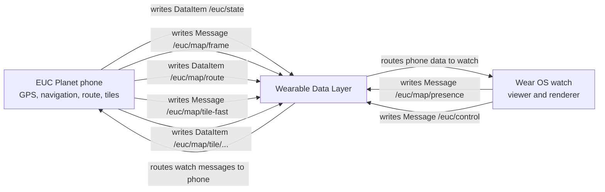

# Wear OS map, developer architecture

This feature is phone-backed. The phone owns GPS, navigation state, route geometry,
raster tile retrieval and caching, and publication through the Wearable Data Layer.
The Wear app is a viewer: it requests the visible scene, receives the current
frame and assets, and renders them on the watch.

## Architecture in 30 seconds

`/euc/state` is the normal state stream. The map paths are separate transport:
presence and frames use Messages, route geometry and persistent tile PNGs use
DataItems with `Asset` payloads, and `/euc/map/tile-fast` carries bounded inline
tile bytes over the connected-node Message path. `/euc/control` is the existing
watch-to-phone action path for controls such as horn, light, and button bindings.
Map zoom is local watch state, not a map control message.

## Setup and configuration

Pair and install the phone and watch applications using the
[Wear OS installation guide](WEAR_OS_INSTALL.md). This document does not duplicate
its ADB or sideload instructions.

On the phone, open Settings, Watch. Enable the map there. The settings are grouped
under `watchMap` in `AppSettings` and in the settings JSON representation:

| Setting | Default | Effect |
| --- | --- | --- |
| `WatchMapSettings.enabled` | `false` | Adds the optional map page and enables map publication. |
| `WatchMapSettings.headingUp` | `false` | `false` is North-up. `true` rotates the map to follow heading. |
| `WatchMapSettings.showTelemetry` | `true` | Shows the optional PWM, speed, and voltage strip. |
| `WatchMapSettings.keepScreenOnDuringNavigation` | `false` | Requests the navigation-only keep-screen-on behavior on Wear OS. |

Changing these values through the phone Watch settings persists them under
`watchMap`. `/euc/state` carries `enabled` (`wme`) and `showTelemetry` (`wmt`).
The map frame carries `headingUp`, so the watch applies the selected orientation
to the current scene. The state stream carries `keepScreenOnDuringNavigation`
(`wkn`) while navigation is active. The watch can therefore restore its persisted
map enablement and telemetry configuration, while orientation and navigation
screen-wake behavior follow the current phone state.
The separate `watchShowNavigation` setting controls whether navigation cues are
published to the watch.

The watch also persists viewer identity, viewer epoch, map zoom, and the last
navigation session that was auto-opened. Zoom starts at 16 and is clamped to the
protocol range described below.

## Runtime lifecycle

The map is an optional third horizontal pager page. With the feature disabled,
the watch has only its two dashboard pages. Enabling it adds page three. Selecting
the map page marks the map as visible and causes the watch to publish presence;
hiding the page publishes a non-visible state and releases map visibility.

The watch's foreground subscription requires all of these conditions:

- Map configuration is enabled.
- The watch activity is resumed and the screen is interactive.
- A paired phone node is known through the Wearable Data Layer.

While subscribed, the watch sends `/euc/map/presence` about every two seconds.
The phone treats a foreground presence as a lease for six seconds. The lease
contains the watch viewer identity and epoch, the presence sequence, visibility,
and the route or tiles still missing on the watch.

The phone requests map GPS work only when the map is enabled, its service is
active, location permission is granted, the location foreground service is ready,
and at least one watch has a valid visible-map lease. The phone-side location
pipeline is authoritative and may use the configured phone GPS source. The watch
never starts a standalone map GPS flow.

During active navigation, the watch can auto-open the map once for that navigation
session. Auto-open requires an enabled map, a foreground watch subscription, a
live map link, a frame whose `enabled` flag is true, and an active navigation
session. The watch stores the session it has already auto-opened, so repeated
frames do not repeatedly animate the pager.
Viewer identity and freshness are explicit session state. The watch creates a
stable `viewerId` and increments `viewerEpoch` when a foreground subscription
starts; its presence sequence resets for that epoch. The phone creates a
`phoneSessionId` for its process. A newer phone session can replace the current
one only after a newer presence echo, and the previous session is then retired.

## Rendered behavior

The phone sends a map frame containing the `enabled` flag, selected layer,
location status, current fix or last-known anchor, heading, navigation session
and route revision, target, and an optional navigation cue. The watch renders:

- Raster tiles from the phone-selected layer.
- The navigation route as a polyline.
- Current position, including a heading arrow when heading is available.
- The navigation target when it is in the visible viewport.
- The optional telemetry strip.
- Turn and arrival cues. A turn cue uses a navigation arrow; arrival uses a flag.

Heading-up rotates the map camera while North-up leaves the camera unrotated. The
watch animates heading changes. When a live link and live fix are present, a change
to the primary cue can trigger a 160 ms watch haptic, subject to the local haptic
rate limit.

The phone selects the map layer from `settings.navMapType` and sends its canonical
layer id in each frame. In this document, a layer is one canonical `MapLayers`
entry and its tile configuration; its provider is the service that serves those
tiles. The watch resolves the same shared registry and shows the corresponding
attribution. The confirmed layers are:

- `OSM`, OpenStreetMap.
- `CYCLOSM`, CyclOSM.
- `TOPO`, OpenTopoMap.
- `HUMANITARIAN`, OpenStreetMap Humanitarian.
- `LIGHT`, Esri World Light Gray Canvas.
- `DARK`, Esri World Dark Gray Canvas.
- `SATELLITE`, Esri World Imagery.

Zoom is controlled locally on the watch with the on-screen minus and plus buttons.
The protocol accepts zoom levels 3 through 19, with 16 as the default. Visible
tiles are requested nearest-first, and the watch uses the selected layer and the
current projection to decide which tiles it needs.

While exact tiles are loading, the watch may render cached same-layer tiles one
native zoom away. Exact tiles win first. If an exact key is explicitly failed,
its fallback is suppressed. Otherwise all cached children at zoom plus one are
drawn, then the cached parent at zoom minus one is cropped to the target
quadrant, then any cached children are drawn. No fallback uses another layer or
more than one zoom away. Each exact arrival replaces only its own fallback, and
the loading indicator and missing-tile status remain based on exact keys.

## Transport and operational limits

| Path | Channel and direction | Responsibility |
| --- | --- | --- |
| `/euc/state` | DataItem, phone to watch | Normal telemetry state, map enabled flag, telemetry flag, and watch display options. |
| `/euc/map/presence` | Message, watch to phone | Viewer identity, epoch, lease sequence, visibility, and missing route or tile keys. |
| `/euc/map/frame` | Message, phone to watch | Current map scene, location status, heading, layer, navigation state, target, cue, and unavailable tiles. |
| `/euc/map/tile-fast` | Message, phone to watch | Low-latency inline encoded tile payload for connected nodes, capped at 96 KiB. It carries the same tile key and delivery generation as the persistent path. |
| `/euc/map/tile/` | DataItem, phone to watch | Persistent raster tile Asset keyed by layer, zoom, x, and y. It is the restart cache and fallback when the fast Message path is unavailable. |
| `/euc/control` | Message, watch to phone | Existing watch actions. It is not the map scene or map zoom transport. |

Operational limits are intentionally small and bounded:

- Presence heartbeats target every 2 seconds. A phone lease expires after 6 seconds.
- Phone map frames follow the shared `watchUpdateRate` cadence: 750 ms for
  `CONSERVATIVE`, 250 ms for the default `NORMAL`, and 150 ms for `FAST`.
- A link is live only while an accepted frame is newer than the 3 second stale
  threshold. The watch can still display cached geometry after that threshold.
- A presence carries at most 25 missing tile requests. The phone loads at most
  four tiles concurrently for the visible watch sessions. For layers without an
  Esri reference overlay, the phone forwards validated encoded tile bytes without
  a full bitmap decode and PNG re-encode. Esri light and dark layers still
  compose their base and reference tiles into one PNG.
- The phone publishes at most four tile DataItems concurrently. It retains at
  most 64 published tile DataItems and evicts the least recently requested
  entries when needed. Its shared `MapTileCache` also supplies the HTTP, encoded,
  and decoded tile caches. The decoded in-memory cache is 64 entries;
  `mapEncodedCacheMiB` and `mapHttpCacheMiB` set the encoded and HTTP budgets.
- The watch decodes at most four tile assets concurrently. A tile asset is
  limited to 4 MiB, and its decoded bitmap cache is bounded at 8 MiB.
- Prepared tiles at or below 96 KiB are offered immediately through the connected
  `/euc/map/tile-fast` Message path and also published through the persistent
  `/euc/map/tile/` DataItem path. Larger tiles skip only the Message offer.

Freshness is based on identity and monotonic revisions, not arrival order alone.
A frame must echo a presence sequence sent by the current viewer identity and epoch.
Frame sequences must advance within a phone process session. A new phone process
session needs a newer presence echo, and a retired phone session cannot return.
Route geometry is accepted only when its navigation session and revision match the
current frame. Both tile paths carry the same key and delivery generation and
converge through the same watch source, viewport, generation, and decode guards.
Tile generations and the current visible viewport prevent late or foreign assets
from replacing current content.

## Failure modes and limitations

- A paired phone and Wearable Data Layer connection are required. The map does not
  work as a standalone watch feature.
- Phone location permission and foreground service readiness are required for a
  live fix. The watch reports permission, phone readiness, waiting-for-fix, or
  stale-fix states rather than obtaining its own GPS fix.
- An uncached tile requires the phone to reach its map provider over the Internet.
  A missing network leaves that tile unavailable until a later request succeeds.
- Cached tiles and route geometry may remain visible while the live frame, link, or
  GPS fix is stale. Cached content is not evidence that the phone is still live.
- There is no offline map download flow and no standalone-watch GPS flow.
- Provider availability, attribution, and fair-use limits remain properties of the
  selected map provider. The watch follows the phone's selected navigation layer;
  it does not choose a separate provider.

## Tests and invariants

The existing tests cover the protocol and session invariants without claiming full
runtime coverage:

- `wear/src/test/java/com/eried/eucplanet/wear/ui/components/WatchMapProjectionTest.kt` protects Web Mercator projection, camera rotation, dateline wrapping, bounded tile rows, and route visibility.
- `hud-protocol/src/test/java/com/eried/eucplanet/hud/protocol/WatchMapSessionTest.kt` protects route and navigation session freshness, revision invalidation, stale-link behavior, and rejection of foreign or older presence echoes and retired phone sessions.
- `hud-protocol/src/test/java/com/eried/eucplanet/hud/protocol/WatchMapLeasesTest.kt` protects lease ownership across nodes, visible versus hidden viewers, six-second expiry, viewer epochs, and restored high-water history.
- `hud-protocol/src/test/java/com/eried/eucplanet/hud/protocol/WearMapProtocolTest.kt` protects wire validation for route coordinates, frame and presence identity, tile bounds, version handling, null fields, malformed input, the 25-request transport limit, and zoom bounds.
- `wear/src/test/java/com/eried/eucplanet/wear/bridge/PendingTileStoreTest.kt` protects tile invalidation when the viewport or source changes and rejects late or older tile generations.
- `app/src/test/java/com/eried/eucplanet/map/MapTileHttpCacheTest.kt` protects HTTP cache reuse, safe resize during an active reader, and recovery after fetch or decode failures.

## File map

| Path | Responsibility |
| --- | --- |
| `app/src/main/java/com/eried/eucplanet/wear/WearMapBridge.kt` | Phone-side lifecycle, lease ownership, GPS demand, frame and route publication, tile loading, and provider selection. |
| `wear/src/main/java/com/eried/eucplanet/wear/bridge/WatchMapRepository.kt` | Watch-side presence, session acceptance, route and tile Asset loading, persistence, bitmap cache, and zoom state. |
| `wear/src/main/java/com/eried/eucplanet/wear/ui/WatchApp.kt` | Optional pager page, map auto-open, visibility lifecycle, and cue haptics. |
| `wear/src/main/java/com/eried/eucplanet/wear/ui/components/WatchMapScreen.kt` | Raster, route, position, target, telemetry, cue, attribution, and zoom rendering. |
| `hud-protocol/src/main/java/com/eried/eucplanet/hud/protocol/WearMapProtocol.kt` | Wire models, paths, timing constants, zoom and request limits, and validation. |
| `hud-protocol/src/main/java/com/eried/eucplanet/hud/protocol/MapLayers.kt` | Canonical layer ids, tile URL templates, native zoom limits, and attribution. |
| `app/src/main/java/com/eried/eucplanet/map/MapTileCache.kt` | Shared phone HTTP, encoded, and decoded raster tile cache used by map surfaces. |
| `app/src/main/java/com/eried/eucplanet/data/model/AppSettings.kt` | `WatchMapSettings` fields and defaults, nested under `AppSettings.watchMap`. |
| `app/src/main/java/com/eried/eucplanet/ui/settings/SettingsScreen.kt` | Phone Watch settings controls for enablement, orientation, telemetry, and navigation screen wake. |
| `app/src/main/java/com/eried/eucplanet/data/store/SettingsJson.kt` | Persistence of the `watchMap` settings object. |
